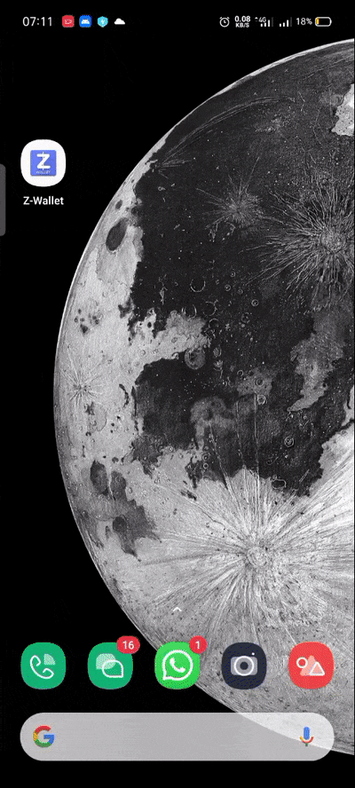

<h1  align="center">Z-Wallet Mobile App</h1>


<p  align="center">Suka ribet buka-buka dompet buat ngeluarin uang?<br/>Simpan aja uangmu di <strong>Z-Wallet</strong> Sekarang!
</p>


<p  align="center"> 
    <a  href="https://github.com/mkhoirulwafa/zwalletMobile">
        
    </a>
</p>

  


  
### # TABLE OF CONTENTS

-  [ABOUT THIS PROJECT](https://github.com/mkhoirulwafa/zwalletMobile#-about-this-project)
-  [FEATURES](https://github.com/mkhoirulwafa/zwalletMobile#-features)
-  [BUILD APK DOWNLOAD](https://github.com/mkhoirulwafa/zwalletMobile#-build-app-apk)
-  [DEMO APP](https://github.com/mkhoirulwafa/zwalletMobile#-demo-app)
-  [WHAT IS USED HERE](https://github.com/mkhoirulwafa/zwalletMobile#-what-is-used-here)
-  [HOW TO RUN THIS APP](https://github.com/mkhoirulwafa/zwalletMobile#-how-to-run-this-app)

  

### # ABOUT THIS PROJECT


<strong>Zwallet</strong> adalah aplikasi dompet digital yang menyederhanakan kebutuhan finansial anda dan dapat menghemat banyak waktu dalam kebutuhan perbankan hanya dengan satu aplikasi. <strong>Zwallet</strong> berada di bidang perbankan digital yang kian hari makin pesat perkembangan nya dengan seiring teknologi yang semakin maju. <strong>Zwallet</strong> berfokus pada penggunaan global atau untuk semua pengguna di dunia. Memiliki ratusan Trusted Partner membuat <strong>Zwallet</strong> memiliki Kredibilitas tinggi. <strong>Zwallet</strong> ini adalah mampu menyimpan uang, melakukan transfer antar pengguna maupun ke bank lokal.

  

### # FEATURES


- Authentication & Authorization

- Topup

- Transfer

- Realtime Balance

- Upload Image Profile

- Reset Password

- PIN Security while Transfer

- Realtime Notification in Completed Transfer or Topup

- Change Password

- Change Pin

- Change Name


### # BUILD APP (APK)  
   [Download APK Build here](http://bit.ly/zwallet-khoirulwafa)
  

### # DEMO APP (Click Link)

-  [Demo Login](https://github.com/mkhoirulwafa/zwalletMobile#login)
-  [Demo History Page](https://github.com/mkhoirulwafa/zwalletMobile#history)
-  [Demo Search & Transfer](https://github.com/mkhoirulwafa/zwalletMobile#search--transfer)
-  [Demo Notification](https://github.com/mkhoirulwafa/zwalletMobile#notification)
-  [Demo Topup Page](https://github.com/mkhoirulwafa/zwalletMobile#topup-page)
-  [Demo Profile Page](https://github.com/mkhoirulwafa/zwalletMobile#profile-page)
-  [Demo Change Name](https://github.com/mkhoirulwafa/zwalletMobile#change-name)
-  [Demo Upload Avatar](https://github.com/mkhoirulwafa/zwalletMobile#upload-image-avatar)

  
  

### # WHAT IS USED HERE

  

-  [React Native](http://reactnative.dev/)

-  [MySQL](https://www.mysql.com/)

-  [ExpressJS](http://expressjs.com/)

-  [React Navigation](https://reactnavigation.org/)

-  [Redux](https://redux.js.org/)


  

### # HOW TO RUN THIS APP

  

1. Make Sure you had clone the repo

```

~$ git clone https://github.com/mkhoirulwafa/zwalletMobile.git

```

2. Open the project and run on terminal

```

~$ npm install

```

or

```

~$ yarn

```

3. Run on your terminal

```

~$ npx react-native run-android

```


### # DEMO


### Login


  
### History


### Search & Transfer


### Notification


### Topup Page


### Profile Page


### Change Name


### Upload Image Avatar

